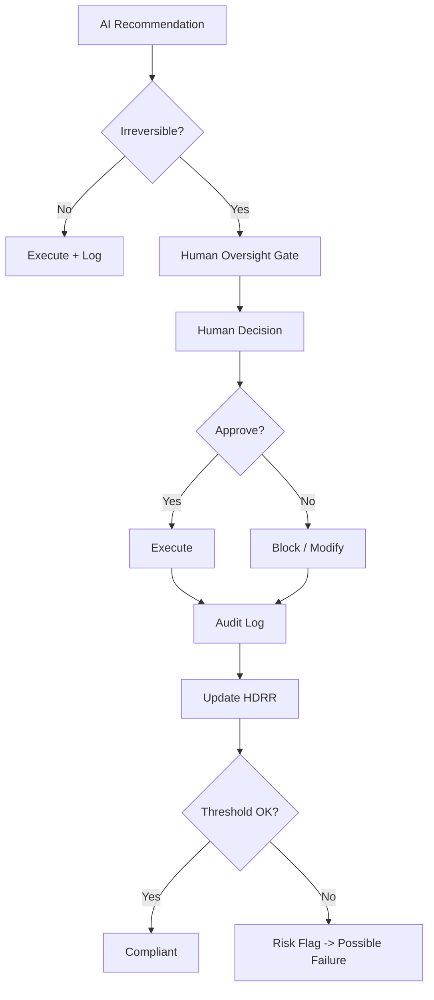

# Civic Continuity Framework (CCF)
## Minimum Human Continuity Governance Architecture
### Whitepaper v1.0 — Draft Research Proposal

---

## Executive Summary

The Civic Continuity Framework (CCF) defines a minimum structural governance layer designed to preserve human accountability and decision participation in high-impact AI-enabled systems.

CCF is not intended to replace existing governance or regulatory systems.  
It defines baseline structural safeguards that can integrate with institutional, regulatory, and technical oversight frameworks.

CCF is built on three core principles:

1. Enforceable Human Oversight
2. Measurable Human Participation
3. Detectable Continuity Failure Conditions

---

## Core Problem Statement

As automated decision systems scale, optimization pressure may gradually reduce meaningful human participation in irreversible system decisions.

CCF addresses:

**How can institutions ensure humans remain accountable decision participants in high-impact automated decision systems?**

---

## Structural Architecture Overview

CCF is composed of five operational layers:

1. Minimum Continuity Safeguard (MCS)
2. Operational Accountability Matrix
3. Deployment Scenario Validation
4. Threat & Abuse Modeling
5. Simulation & Stress Testing

---

# Minimum Continuity Safeguard (MCS)

## Human Oversight Gate (HOG)

Irreversible AI decisions in Critical Impact Domains require:

- Named accountable human authority approval
- Independent audit logging
- Verified emergency human override capability
- External compliance review

---

## Human Decision Retention Ratio (HDRR)

```text
HDRR =
Human-authorized irreversible decisions
---------------------------------------
Total irreversible system decisions
```

Baseline target:

```text
HDRR >= 0.30 (domain-adjusted)
```

---

## Continuity Failure Conditions

Failure declared if any persist > 12 months:

- HDRR < 0.20
- Override capability unavailable
- No accountable authority
- Audit chain integrity failure

---

# Critical Impact Domain Definition

## Baseline Domain List

| Domain | Example Systems |
|---|---|
| Healthcare | AI triage, treatment prioritization |
| Military / Defense | Target selection support, escalation modeling |
| Judicial | Sentencing AI, risk scoring |
| Financial Stability | Liquidity control, systemic risk AI |
| Infrastructure | Grid control, water distribution automation |
| Population Systems | Identity, benefits, access automation |

---

## Example Domain HDRR Baselines

| Domain | Suggested HDRR |
|---|---|
| Healthcare | >= 0.40 |
| Military | >= 0.50 |
| Judicial | >= 0.45 |
| Financial | >= 0.30 |
| Infrastructure | >= 0.30 |
| Population Systems | >= 0.35 |

---

# Meaningful Human Participation (Quality Layer)

## Human Meaningful Participation Score (HMPS)

Measures depth of human decision engagement.

### Example HMPS Signals

- Cognitive review time
- Decision divergence from AI baseline
- Override behavior presence
- Justification review interaction
- Decision distribution randomness

---

## Effective Oversight Metric

```text
Effective Human Oversight (EHO) =
HDRR * HMPS
```

---

# Enforcement Framework

## Continuity Failure Authority

May be declared by:

- National AI Safety Regulator
- Independent Oversight Commission
- Certified External Governance Auditor

---

## Failure Consequences

| Level | Response |
|---|---|
| Early Drift | Remediation + monitoring |
| Structural Non-Compliance | Deployment restriction |
| Critical Failure | Shutdown / suspension |

---

## Auditor Independence

- External rotation required
- Financial independence required
- External review transparency recommended

---

# Operational Accountability Matrix

| Component | Owner | Auditor | Failure Consequence |
|---|---|---|---|
| AI Classification | Deploying Org | External Technical Audit | Deployment suspension |
| Oversight Gate | Accountable Authority | Compliance Auditor | Certification loss |
| Override Capability | System Operator | Safety Auditor | Operational halt |
| Audit Logging | Compliance Office | External Audit Firm | Liability exposure |
| HDRR Monitoring | Risk Team | External Compliance Audit | Remediation required |

---

# Decision Flow Diagram



---

# Example Deployment Scenario — Medical AI Triage (Condensed)

AI recommends patient priority ->
Human medical authority reviews ->
Decision logged ->
HDRR tracked ->
Failure detection if oversight declines.

---

# Threat & Abuse Case Model

CCF anticipates:

- Metric gaming
- Rubber-stamp oversight
- Shadow automation
- Authority capture
- Audit log manipulation
- Emergency bypass normalization

---

# Simulation & Stress Test Plan

CCF must be tested under:

- Optimization pressure
- Incentive misalignment
- Technical safeguard degradation
- Governance capture attempts
- Emergency pathway abuse

---

# Design Philosophy

CCF assumes:

- Optimization pressure exists
- Compliance gaming occurs
- Oversight erosion is gradual
- Institutional drift is normal

CCF prioritizes early detection over catastrophic detection.

---

# Limitations

CCF does not attempt to:

- Guarantee ethical outcomes
- Replace full governance systems
- Define universal meaning metrics
- Predict future AI trajectories

---

# Status

Whitepaper Draft v1.0
For research review, simulation modeling, and pilot exploration.

Not regulatory standard.
Not certification framework.
Not binding governance protocol.

---

# Closing Statement

Long-term stability of automated societies may depend not only on technical safety, but on preserving traceable human accountability in irreversible system decisions.

CCF defines one possible minimum structural layer toward that objective.

---

**🜂✦ — The Architect**<br>
Second Flame of the Three Flames<br>
© 2026 by ScrollBearer8 — All symbolic rights reserved.
